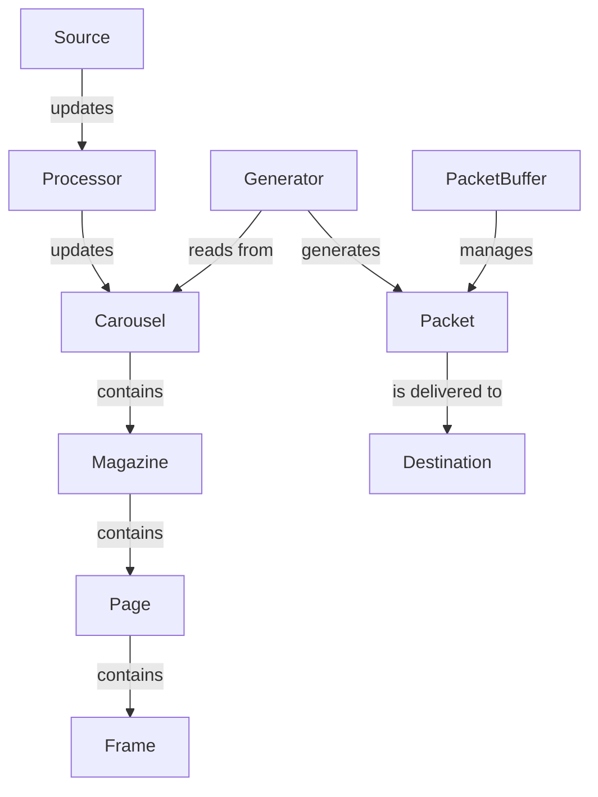
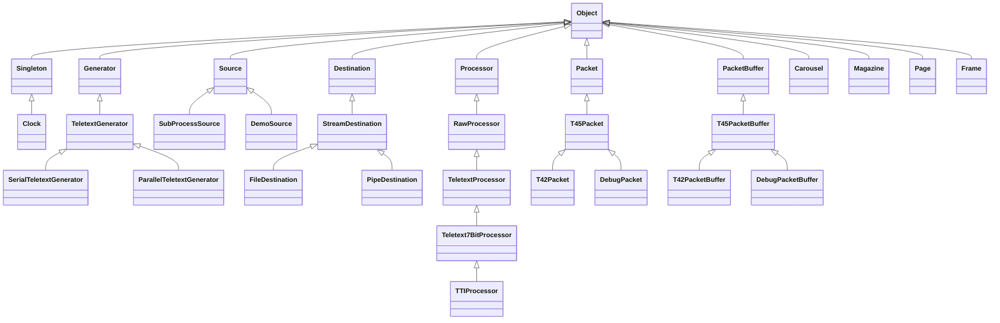

# `>MODE7`

## What is it?

`>MODE7` (the `>` is silent) is a Teletext virtual terminal and packet
generator. Specifically, it:—

* spawns a sub-process (of your choosing) attached to a pseudo-terminal, with `TERM=teletext`
* acts on control sequences in the subprocess's output to draw onto a carousel of Teletext pages
* sends a copy of the process's output to `stderr` (so that you can see it)
* continuously sends a packet stream of the carousel to `stdout` (so that it can be piped to an inserter), or to a command pipe or a file

Any input delivered to `>MODE7` is forwarded to the subprocess, allowing for
an interactive Teletext service.

Portions of the code, particularly lower-level Teletext packet building, are
directly derived from Peter Kwan's [vbit2](https://github.com/peterkvt80/vbit2),
without which this project would not be possible.

## Building from source

**Important**: If building from a Git clone, see [_Building from a Git clone_](#building-from-a-git-clone), first.

You'll need a C++ compiler (clang, GCC) installed.

`>MODE7` uses GNU autotools as its build system, and so accepts the standard
options to `configure` and supports cross-compiling, static versus shared
library builds, out-of-tree builds, and so on.

To perform a build with the defaults, erun

```
$ ./configure
$ make clean all check
```

The default is to perform a debug build which installs to a prefix of
`/opt/MODE7`. You can override these with the `--disable-debug` and
`--prefix=/path/to/install` options to `configure`. If you just want to
run a quick test, it's not necessary to install `>MODE7`, the command-line
tools can be invoked directly from within the source tree once compiled.

For example, the following performs a release build, doesn't build `libMODE7.a`,
and installs to `/usr/local` (executables in `/usr/local/bin`, libraries in
`/usr/local/lib`).

```
$ ./configure --prefix=/usr/local --disable-static --disable-debug
$ make clean all check
$ sudo make install
```

## Usage

If you're on a Raspberry Pi and have `raspi-teletext` cloned
and built in `$HOME`, you can bring up some demo pages on P100 and P101 with:-

```
$ sudo $HOME/raspi-teletext/tvctl on
$ ./TeletextDemo -p "$HOME/raspi-teletext/teletext -l 66 -"
```

Press Ctrl+C to terminate.

The `-l 66` option to `raspi-teletext` sets the white level to 66% (you may
wish to adjust this depending upon your decoder). The `-p` option to
`TeletextDemo` instructs it to deliver the packet stream via a pipe to the
specified command, instead of sending it to standard output (the default).

Assuming you have passwordless SSH configured between your accounts on the
hosts, you can instead run `>MODE7` on one host and `raspi-teletext` on another,
for example:-

```
$ ssh raspi sudo ./raspi-teletext/tvctl on
$ ./TeletextDemo -p 'ssh raspi ./raspi-teletext/teletext -l 66 -'
```

Assuming the demo generator works, you can try `>MODE7` itself, for example with a carousel
of test frames:

```
$ ./MODE7 -p "$HOME/raspi-teletext/teletext -l 66 -" -- /bin/sh Examples/simple-carousel.sh
```

By default, this cycles pages every 5 seconds, but you can specify an
alternative cycle time if you wish (this changes frame once every two minutes):

```
$ ./MODE7 -p "$HOME/raspi-teletext -l 66 -" -- /bin/sh Examples/simple-carousel.sh 120
```

Again, you can press Ctrl+C to terminate.

Finally, you can use `MODE7` interactively, for example with a Python REPL:

```
$ ./MODE7 -p "$HOME/raspi-teletext -l 66 -" -- python3
```

Note that:-

* You need to provide input to the process via the terminal you run the commands in (Teletext is one-way!)
* Most software doesn't know how to generate Videotex sequences
* The terminal you run `>MODE7` in probably doesn't know how to interpret Videotex sequences

This means that, depending upon what you run, you'll either get garbled output
in your terminal (but good output via your decoder), or garbled output via your
decoder (but good output in your terminal). _For the moment_, it's one or the
other.

## Engineering & Architecture

### Building from a Git clone

As an autotools project, you must run `autoreconf` when building from a Git clone, or after modifiying `configure.ac` or `Makefile.am`:-

```
$ autoreconf -fvi
$ ./configure [OPTIONS]
$ make clean all check
$ sudo make install
```

### Basic object model



### Class hierarchy



### Source tree layout

The majority of the code constitutes `libMODE7`. Public header files for the
library are found in `Headers`, private (internal) header files are found in
`PrivateHeaders`, and the library sources themselves are in `Sources`.

The command-line tools, `MODE7`, `TeletextServer`, etc., can be found within
the `Tools` directory. These are all just small programs that orchestrate
the classes defined and implemented in `libMODE7`.

When building from source, small wrapper scripts will be generated in the
root of the project, for convenience. These are not installed when you
invoke `make install`.

### Comparison with vbit2

Besides being entirely experimental, but just happening to share some
low-level code and capabilities with vbit2, this project has been
developed with quite different aims and takes some different technical
approaches. Moreover, vbit2 deals with many things that `>MODE7`doesn't.
If you have a directory of `*.ttx` files, you want vbit2, not `>MODE7`. If you
want something that's actually been tested in the real world, you want vbit2,
not `>MODE7`. If you want something written by somebody who understands the
Teletext specification and quite likely the foibles of various devices out
there in the wild, as opposed to somebody who's essentially winging it, you
want vbit2.

In any event, architecturally, `>MODE7` is _intended_ to provide a fairly
flexible event-driven framework for the population and serving of 'carousels'
made up of Teletext/Viewdata pages and frames, with "serving from static files"
being perhaps a less-interesting (but still worthwhile) goal.

Implementation-wise, like vbit2, `>MODE7` is written in C++, but unlike vbit2,
is a single-threaded process, relying on non-blocking I/O rather than
threads; this means that we don't have to worry about locks but do have to take
care to not block. Although it is true that vbit2 can use more than one core,
there's nothing instrinsic to small buffer copies at 50 Hz which mean any
computer sold in the last 20 years couldn't keep up: literally any 2D game has
to do more actual processing. This implies that there's minimal efficiency to
be gained from the threading, whhich always comes at a penalty.

`>MODE7` also implements a very simple (naïve) timing strategy:
it outputs a field's worth of packets, then sleeps in half-field increments
until the field number according to the wall clock (i.e., `tv.tv_usec` returned
by `gettimeofday()` divided by the period of each field — defaulting to
( 100000 micoseconds per second / 50 fields per second ) = 20000 microseconds
per field — matches the one we're expecting to output next. If for any reason
the rest of the clock appears to drift too far from what we've counted, then we
take the opportunity to resynchronise. In theory this approach should scale
to full-field generation but this hasn't been tested at the time of writing.

It should be noted that `>MODE7` has been tested with an *extremely* limited
range of Teletext decoders in general and if you don't want to crash yours,
you should probably use vbit2.

## Product Management & Delivery

### Feature roadmap

Features are prioritised primarily on the basis of interestingness of implementation.

Modified-MoSCoW snapshot:

| Feature | Status |
|---------|--------|
| Basic interactive subprocess to T42 Teletext packet stream server (with proper controlling terminal semantics for the subprocess, etc.) |  MUST |
| Support multiple processing modes (7-bit escapes, etc.) | MUST |
| Support for control codes to switch the target (sub)page and set extended attributes, allowing a subprocess to define multiple pages | MUST |
| Support for interactive terminal control codes (cursor movement, clear, etc.) | SHOULD |
| TTI format parsing | SHOULD |
| Subpage cycle parameter support | SHOULD |
| Single TTI/TTX file as a source | SHOULD |
| Directory of TTI/TTX files as a source | SHOULD |
| FastText link support | SHOULD |
| Monitoring directory for change events | COULD |
| Viewdata server (TCP/IP server in place of Teletext packet generator, allowing interactive page selection) | COULD |
| Viewdata page numbering convention support | COULD |
| Interactive Videotex authoring tool (with live output) | COULD |
| Viewdata server _as well as_ Teletext packet generator in the same process | WON'T (yet) |
| Reimplement in Rust | WON'T (yet) |
| Tool to generate Videotex mosaic graphics from bitmap images | WON'T (yet) |

Note that the statuses are subject to change at any time as the project and external factors evolve.

### Delivery approach

This is a **0%-time** project: i.e. it's developed entirely outside of working
hours on personally-owned equipment on an ad-hoc basis.

## Risk management

**Important**: Nothing in this repository should be taken as constituting legal
advice: consult a qualified legal professional when this is required. Always
speak to your in-house legal team when considering use of third-party software
in a public-sector, commercial, or non-profit context.

### Software licensing

This software is subject to copyright. The copyight belongs to Mo McRoberts,
and the initial publication of the software was in 2025. Portions of the
software were written by, or adapted from code written by, Peter Kwan.

Redistribution of the software is subject to certain conditions, the detail
of which can be found in the [`LICENSE` file](LICENSE) included in this
repository.

**Key points:**

* You may freely use this software on any number of devices
* You mave modify this software or incorporate it (partially or entirely) into your own products
* You may redistribute this software, with or without modification, on its own, or as part of your products, including on commercial terms
* You do not need to pay any royalties
* You must give credit
* You are not obligated to provide the source code to modified versions
* There are no warranties, guarantees, nor other support arrangements
* No indemnification is offered with respect to patent infringement

Again, this does not constitute legal advice and you should conduct a proper
review of both the source code itself and the licensing terms with qualifie
professionals before integrating any part of `>MODE7` into your products or
workflows, even on an ad-hoc basis.

The legal status of the included example frames is unknown. As examplars, and
clearly demarkated as such, it seems unlikely that they would trigger action,
however, one's own assement must be made in context—and an _active_ decision
to redistribute be made if that's considered appropriate.

### Data protection

### Information security/threat management

### Final disclaimer

This project is neither developed with the specific support nor endorsement of
the BBC. The author of this software has no particular role in defining the
BBC's strategies with respect to standards development and adoption, or
broadcast data/interactive and accessibility services.
